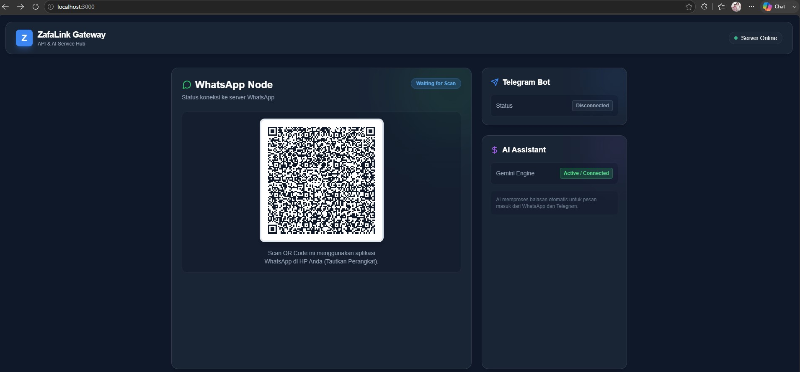

<div align="center">
  <h1>🚀 ZafaLink Messaging Gateway</h1>
  <p><i>Solusi Gateway Notifikasi Cerdas dengan Integrasi WhatsApp, Telegram, dan AI (Google Gemini)</i></p>

  <p>
    <a href="#fitur-utama">Fitur</a> •
    <a href="#teknologi-yang-digunakan">Teknologi</a> •
    <a href="#tampilan-antarmuka">Antarmuka</a> •
    <a href="#tutorial-instalasi">Instalasi</a> •
    <a href="#cara-penggunaan">Penggunaan</a>
  </p>
</div>

---

## 👋 Selamat Datang di ZafaLink Gateway!

**ZafaLink Messaging Gateway** adalah sebuah aplikasi inovatif yang dirancang untuk menjadi jembatan komunikasi modern antara sistem Anda dengan pengguna akhir. Dengan dukungan notifikasi lintas platform melalui WhatsApp dan Telegram, aplikasi ini memastikan pesan-pesan penting selalu tersampaikan dengan tepat waktu dan akurat.

Tidak hanya sebatas mengirim dan menerima pesan, sistem ini juga telah dibekali dengan **Kecerdasan Buatan (AI)** melalui integrasi canggih Google Gemini. AI ini siap melayani pengguna selayaknya asisten pelanggan profesional yang ramah selama 24/7! 🤖✨

Jika proyek ini bermanfaat bagi Anda, **jangan lupa berikan bintang (⭐) pada repositori ini**! Dukungan Anda sangat berarti. 🙏

---

## 🛠️ Teknologi yang Digunakan

Aplikasi ini dibangun menggunakan teknologi web dan Node.js terkini untuk memastikan performa yang super cepat dan stabil:

*   **[Node.js](https://nodejs.org/)** - Runtime environment JavaScript yang andal.
*   **[Express.js](https://expressjs.com/)** - Framework web backend (API) terbaik untuk Node.js.
*   **[@whiskeysockets/baileys](https://github.com/WhiskeySockets/Baileys)** - Library tangguh untuk koneksi WhatsApp Web Multi-Device tanpa browser.
*   **[node-telegram-bot-api](https://github.com/yagop/node-telegram-bot-api)** - Modul integrasi Bot API Telegram yang komprehensif.
*   **[@google/generative-ai](https://ai.google.dev/)** - Integrasi cerdas dari Google (Gemini 1.5 Flash) untuk *auto-reply* pintar yang memanjakan pelanggan.

---

## 🖥️ Tampilan Antarmuka (UI)

Berikut adalah tampilan antarmuka (Dashboard) dari **ZafaLink Gateway** yang memantau status koneksi WhatsApp, Telegram Bot, dan AI Gemini Engine secara *real-time*:



*(Catatan: Simpan gambar screenshot UI Anda dengan nama `ui-dashboard.png` di dalam folder `docs/`)*

---

## 📦 Tutorial Instalasi

Ikuti langkah-langkah mudah berikut untuk mulai menjalankan ZafaLink Gateway di komputer atau server Anda:

### 1. Persiapan Awal
Pastikan Anda sudah menginstal [Node.js](https://nodejs.org/) (disarankan versi 18 atau terbaru) dan `git` di komputer Anda.

### 2. Clone Repositori
Clone kode sumber proyek ini ke komputer Anda, lalu masuk ke foldernya:
```bash
git clone https://github.com/edholabs/chatbot-ai.git
cd chatbot-ai
```

### 3. Instal dependensi
Jalankan perintah ini untuk menginstal semua library yang dibutuhkan:
```bash
npm install
```

### 4. Konfigurasi Environment (`.env`)
Salin file konfigurasi *example* menjadi file `.env` asli:
```bash
cp .env.example .env
```
*(Untuk pengguna Windows CMD, gunakan: `copy .env.example .env`)*

Buka file `.env` dan atur konfigurasinya sesuai kebutuhan:
```ini
# Server Configuration
PORT=3000

# WhatsApp Configuration
ENABLE_WHATSAPP=true

# Telegram Configuration
ENABLE_TELEGRAM=true
TELEGRAM_BOT_TOKEN=token_bot_telegram_anda

# AI Configuration (Google Gemini)
ENABLE_AI_REPLY=true
GEMINI_API_KEY=api_key_gemini_anda
```

### 5. Jalankan Aplikasi
Jalankan aplikasi melalui terminal:
```bash
node server.js
```
*   **Untuk WhatsApp:** Lihat terminal Anda, sebuah QR Code akan muncul. Buka aplikasi WhatsApp di HP Anda -> Perangkat Tertaut -> Tautkan Perangkat, lalu scan QR Code tersebut.
*   **Untuk Telegram:** Pastikan Anda sudah membuat bot melalui [@BotFather](https://t.me/botfather) dan memasukkan tokennya di `.env`.

Selesai! ZafaLink Gateway kini sudah berjalan di `http://localhost:3000`. 🎉

---

## 🚀 Cara Penggunaan (API Endpoint)

Untuk mengirim pesan otomatis dari sistem lain (misalnya dari aplikasi web ZafaLink Anda) ke WhatsApp atau Telegram pengguna, Anda bisa melakukan request HTTP POST ke endpoint berikut:

**Endpoint:**
`POST http://localhost:3000/api/send`

**Headers:**
`Content-Type: application/json`

**Body (JSON):**
```json
{
  "provider": "whatsapp",
  "to": "081234567890",
  "message": "Halo, ini pesan dari ZafaLink Gateway!"
}
```
*Ganti `"provider"` dengan `"telegram"` dan `"to"` dengan Chat ID Telegram jika ingin mengirim ke Telegram.*

---

## 🐛 Laporan Bug & Kontribusi

Kami sangat menghargai masukan dari Anda! Jika menemukan bug atau masalah (misalnya saat pengiriman pesan, error saat scan QR, atau AI yang tidak merespon), silakan buat **Issue** di GitHub. 

Semua *Pull Request* juga sangat dipersilakan untuk turut mengembangkan proyek ini.

---

<p align="center">
  <b>Developed by Edho Walla</b><br>
  Jangan lupa berikan ⭐ (Star) jika proyek ini membantu Anda!
</p>
